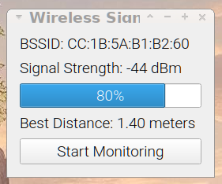

# Wireless Signal Strength Meter (wssm)

This is a quick and dirty app I wrote while teaching myself PyQt. 

I wrote this while I was in a remote conference and struggling with random and non-linear wireless network throughput with 500-700 of my colleagues. 

While moving from conference room to confernece room in a large hotel setting, roaming signal strength varies wildly, from distance to the associated AP to walls and doors and other frequency obstructions. 


## Installing
To install this, simply follow these steps: 

### Install the Python3 Virtual Environment support
```
sudo apt install python3-venv
```

### Copy the code to your local machine
```
cd /tmp/
git clone https://github.com/desrod/wssm
cd wssm
```

### Initialize your Python virtual environment
```
python3 -m venv env
. env/bin/activate
```

### Install the required Python dependencies
```
pip install -r requirements.txt
./wssm.py
```

If you got all of the dependnecies correct, you should now see something that looks like this: 




## Running and Monitoring
Click "Start Monitoring" to begin the scanning and monitoring of your WiFi adapter's signal strength. Now you should see something that looks like this: 


